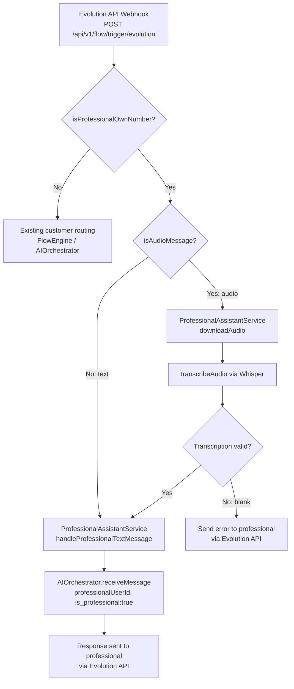

# Design Document — Professional Audio Assistant

## Overview

The Professional Audio Assistant extends the existing Evolution API webhook handler to give the professional (the platform owner) a personal AI assistant accessible via their own WhatsApp number. When the professional sends a message from the phone number stored in the `secretary_phone` setting, the system routes it to the `AIOrchestrator` instead of the customer flow. Audio and voice-note messages are transcribed via OpenAI Whisper before being forwarded.

The feature is **purely additive**: no existing module interfaces, FlowEngine logic, or customer-facing AIOrchestrator behavior are modified. All new logic lives inside `src/modules/professionalFlow/professionalAssistant.service.ts`, which already exists as a stub.

---

## Architecture

### High-Level Flow



### Integration Points (read-only)

| Existing component | How it is used | Modified? |
|---|---|---|
| `flowEngine.controller.ts` → `triggerFlowEvolution` | Calls `isProfessionalOwnNumber`; new branch calls `ProfessionalAssistantService` | **No** — only the existing `handleProfessionalMessage` call is replaced by the new service method |
| `AIOrchestrator.receiveMessage` | Called with professional's phone as `phoneNumber` and `is_professional:true` in session context | **No** |
| `OpenAIClient` | Instantiated with the agent's API key for Whisper calls | **No** |
| `EvolutionApiService.sendTextMessage` | Used to send responses back to the professional | **No** |
| `SessionManager.findOrCreateSession` | Creates professional sessions keyed to professional's phone | **No** |

---

## Components and Interfaces

### 1. `ProfessionalAssistantService` (new, in `professionalFlow` module)

Replaces the current stub `handleProfessionalMessage` function with a class-based service that handles both text and audio messages.

```typescript
// src/modules/professionalFlow/professionalAssistant.service.ts

export interface ProfessionalAssistantDependencies {
  aiOrchestrator: AIOrchestrator;
  evolutionApiService: EvolutionApiService;
  logService: LogService;
}

export class ProfessionalAssistantService {
  constructor(private deps: ProfessionalAssistantDependencies) {}

  /**
   * Main entry point called from triggerFlowEvolution when isProfessionalOwnNumber is true.
   * Handles both text and audio messages.
   */
  async handleMessage(params: HandleProfessionalMessageParams): Promise<void>;

  /** Detects whether the Evolution API payload contains an audio message. */
  isAudioMessage(payload: EvolutionWebhookPayload): boolean;

  /** Extracts audio content (URL or base64) from the payload. */
  extractAudioContent(payload: EvolutionWebhookPayload): AudioContent | null;

  /** Downloads audio from URL or decodes base64 to a Buffer. */
  async resolveAudioBuffer(content: AudioContent): Promise<Buffer>;

  /** Calls OpenAI Whisper to transcribe an audio buffer. */
  async transcribeAudio(buffer: Buffer, mimeType: string, apiKey: string): Promise<string>;

  /** Resolves the OpenAI API key from the professional's agent config. */
  async resolveApiKey(professionalUserId: string): Promise<string | null>;
}
```

#### `HandleProfessionalMessageParams`

```typescript
export interface HandleProfessionalMessageParams {
  fromNumber: string;           // Professional's phone number (normalized)
  professionalUserId: string;   // user_id from WhatsappConnection
  instanceName: string;         // Evolution instance name
  instanceApikey: string;       // Evolution instance API key
  rawPayload: EvolutionWebhookPayload; // Full Evolution webhook payload
}
```

#### `AudioContent`

```typescript
export interface AudioContent {
  type: 'url' | 'base64';
  value: string;                // URL string or base64 string
  mimeType: string;             // e.g. 'audio/ogg'
  filename: string;             // e.g. 'audio.ogg'
}
```

#### `EvolutionWebhookPayload` (subset relevant to audio)

```typescript
export interface EvolutionWebhookPayload {
  event: string;
  instance: string;
  data: {
    key: { remoteJid: string; fromMe: boolean; id: string; senderPn?: string };
    pushName?: string;
    message?: {
      conversation?: string;
      extendedTextMessage?: { text: string };
      audioMessage?: EvolutionAudioMessage;
      pttMessage?: EvolutionAudioMessage;
      documentMessage?: EvolutionDocumentMessage;
    };
  };
}

export interface EvolutionAudioMessage {
  url?: string;
  mediaUrl?: string;
  base64?: string;
  mimetype?: string;
  seconds?: number;
}

export interface EvolutionDocumentMessage {
  url?: string;
  mediaUrl?: string;
  base64?: string;
  mimetype?: string;
  fileName?: string;
}
```

### 2. Changes to `triggerFlowEvolution` (minimal, additive)

The existing professional branch in `flowEngine.controller.ts` currently calls the old `handleProfessionalMessage` stub. It will be updated to call `ProfessionalAssistantService.handleMessage` instead, passing the full raw payload. The `isProfessionalOwnNumber` gate remains unchanged.

```typescript
// BEFORE (existing stub call):
const assistantResult = await handleProfessionalMessage(messageText, flowUserId);
await evolutionApiService.sendTextMessage(..., assistantResult.message);

// AFTER (new service call — no other changes):
await professionalAssistantService.handleMessage({
  fromNumber,
  professionalUserId: flowUserId,
  instanceName: conn.evolution_instance_name,
  instanceApikey: conn.evolution_instance_apikey,
  rawPayload: payload,
});
// Response sending is handled internally by ProfessionalAssistantService
```

### 3. `isProfessionalOwnNumber` (unchanged)

The existing function in `professionalAssistant.service.ts` is kept as-is. It is the sole gate for professional identity detection.

```typescript
export async function isProfessionalOwnNumber(
  fromNumber: string,
  professionalUserId: string
): Promise<boolean>
```

---

## Data Models

### Session Context for Professional Sessions

Professional sessions reuse the existing `mv_flow_sessions` table (no schema migration needed). The `context_json` field includes an additional flag:

```json
{
  "phone": "5511999999999",
  "user_id": "uuid-of-professional",
  "flow_id": null,
  "time_of_day": "bom dia",
  "is_returning_customer": false,
  "is_professional": true
}
```

The `is_professional: true` flag is injected by `ProfessionalAssistantService` before calling `AIOrchestrator.receiveMessage`. The `SessionManager.findOrCreateSession` call uses `phoneNumber = professional's phone` and `professionalUserId = professional's user_id`, which naturally scopes the session to the professional.

### Audio Message Payload Fields

Evolution API audio payloads follow this structure (field names vary by message type):

| Field path | audioMessage | pttMessage | documentMessage (audio) |
|---|---|---|---|
| MIME type | `data.message.audioMessage.mimetype` | `data.message.pttMessage.mimetype` | `data.message.documentMessage.mimetype` |
| Media URL | `data.message.audioMessage.url` or `mediaUrl` | same | same |
| Base64 | `data.message.audioMessage.base64` | same | same |
| Filename | `audio.ogg` (derived) | `ptt.ogg` (derived) | `data.message.documentMessage.fileName` |

Supported MIME types: `audio/ogg`, `audio/mpeg`, `audio/mp4`, `audio/webm`, `audio/wav`.

### API Key Resolution

The service resolves the OpenAI API key using the same priority chain as `AIOrchestrator.selectAgent`:

1. Professional's `selected_agent_id` setting → `cad_agents_admin`
2. First active `cad_agents_admin` record
3. Professional's own `cad_agents` record

This is extracted into a shared helper or the service calls `AIOrchestrator`'s private `selectAgent` logic indirectly by delegating the full message to `AIOrchestrator.receiveMessage` (which already handles key resolution internally). For Whisper specifically, the service calls `selectAgent`-equivalent logic to get the key before the audio download step.

---

## Correctness Properties

*A property is a characteristic or behavior that should hold true across all valid executions of a system — essentially, a formal statement about what the system should do. Properties serve as the bridge between human-readable specifications and machine-verifiable correctness guarantees.*

### Property 1: Phone suffix matching

*For any* pair of phone number strings, `isProfessionalOwnNumber` SHALL return `true` if and only if the last 11 digits of both numbers are identical, regardless of leading country code digits or non-numeric characters.

**Validates: Requirements 1.1, 1.2**

---

### Property 2: Professional session isolation

*For any* message handled by `ProfessionalAssistantService`, the `FlowSession` created or reused SHALL have `phone_number` equal to the professional's normalized phone number AND `context_json` containing `"is_professional": true`.

**Validates: Requirements 2.2, 2.4, 7.1, 7.2**

---

### Property 3: Audio payload detection

*For any* Evolution API webhook payload containing `data.message.audioMessage`, `data.message.pttMessage`, or `data.message.documentMessage` with a supported audio MIME type, `isAudioMessage` SHALL return `true`. For any payload that does not contain these fields (or contains a non-audio MIME type), `isAudioMessage` SHALL return `false`.

**Validates: Requirements 3.1, 5.1**

---

### Property 4: Transcription forwarding

*For any* non-blank transcription string returned by Whisper, the text forwarded to `AIOrchestrator.receiveMessage` as the `message` parameter SHALL contain exactly that transcription text (possibly with an audio context prefix, but the transcription content must be preserved verbatim).

**Validates: Requirements 3.4, 4.1**

---

### Property 5: Blank transcription rejection

*For any* string composed entirely of whitespace characters (including the empty string), `ProfessionalAssistantService` SHALL NOT call `AIOrchestrator.receiveMessage` and SHALL send an error message to the professional via the Evolution API.

**Validates: Requirements 3.5**

---

### Property 6: Audio context indicator

*For any* audio message that produces a valid transcription, the `message` parameter passed to `AIOrchestrator.receiveMessage` SHALL include a marker indicating the original message was audio (e.g., a `[Áudio transcrito]` prefix or equivalent).

**Validates: Requirements 4.2**

---

### Property 7: Audio content extraction

*For any* audio payload where `mediaUrl` or `base64` is present, `extractAudioContent` SHALL return an `AudioContent` object whose `value` field equals the `mediaUrl` or `base64` string from the payload, and whose `mimeType` matches the payload's `mimetype` field.

**Validates: Requirements 5.2**

---

### Property 8: Base64 decode round-trip

*For any* binary `Buffer`, encoding it to a base64 string and then decoding it back SHALL produce a `Buffer` byte-for-byte identical to the original.

**Validates: Requirements 5.3**

---

### Property 9: MIME type acceptance

*For any* MIME type in `{ audio/ogg, audio/mpeg, audio/mp4, audio/webm, audio/wav }`, the audio processing pipeline SHALL accept the file. For any MIME type outside this set, the pipeline SHALL reject it and send an error message to the professional.

**Validates: Requirements 5.5**

---

### Property 10: Whisper File object format

*For any* audio `Buffer` and supported MIME type, the `File`-compatible object constructed for the Whisper API call SHALL have a non-empty `name` field and a `type` field equal to the provided MIME type.

**Validates: Requirements 8.5**

---

## Error Handling

All error paths send a Portuguese-language message to the professional via `EvolutionApiService.sendTextMessage` and log the error via `LogService`. No error propagates to the HTTP response (the webhook always returns `200 OK`).

| Error condition | User-facing message (pt-BR) | Downstream action |
|---|---|---|
| No OpenAI API key configured | `"Assistente não configurado. Configure um agente com chave OpenAI para usar esta funcionalidade."` | Stop; do not call Whisper or AIOrchestrator |
| Audio download fails (HTTP error) | `"Não foi possível baixar o áudio. Tente novamente ou envie uma mensagem de texto."` | Stop; do not call Whisper |
| Whisper API call fails | `"Não foi possível transcrever o áudio. Tente novamente ou envie uma mensagem de texto."` | Stop; do not call AIOrchestrator |
| Blank/empty transcription | `"Não consegui entender o áudio. Poderia repetir ou enviar uma mensagem de texto?"` | Stop; do not call AIOrchestrator |
| AIOrchestrator throws | `"Desculpe, ocorreu um erro ao processar sua mensagem. Tente novamente em instantes."` | Log error |
| Unsupported audio MIME type | `"Formato de áudio não suportado. Envie áudios em formato OGG, MP3, MP4, WebM ou WAV."` | Stop |

All errors are logged with `level: 'error'`, `module: 'professional_assistant'`, and relevant metadata (phone number, user_id, error message, stack trace).

---

## Testing Strategy

### Unit Tests (example-based)

Located in `src/modules/professionalFlow/__tests__/professionalAssistant.service.test.ts`.

- Text message from professional → `AIOrchestrator.receiveMessage` called with correct params
- Non-professional message → existing routing unchanged (AIOrchestrator not called via professional path)
- Audio download failure → error message sent, Whisper not called
- Whisper failure → error message sent, AIOrchestrator not called
- No API key → error message sent, Whisper not called
- `whisper-1` model always used (8.3)
- Language `pt` always set (8.4)
- Correct `professionalUserId` passed to AIOrchestrator (7.4)

### Property-Based Tests (fast-check)

Located in `src/modules/professionalFlow/__tests__/professionalAssistant.properties.test.ts`.

Uses **fast-check** (already in `devDependencies`). Each property test runs a minimum of **100 iterations**.

Tag format: `// Feature: professional-audio-assistant, Property N: <property_text>`

```typescript
// Property 1: Phone suffix matching
fc.assert(fc.property(
  fc.string({ minLength: 11 }).filter(s => /\d{11}/.test(s)),
  fc.string(),
  (base, prefix) => {
    const registered = prefix + base;
    const incoming = base;
    return isProfessionalOwnNumberSync(incoming, registered) === true;
  }
), { numRuns: 100 });

// Property 3: Audio payload detection
fc.assert(fc.property(
  fc.oneof(audioMessagePayloadArb, pttMessagePayloadArb, documentAudioPayloadArb),
  (payload) => isAudioMessage(payload) === true
), { numRuns: 100 });

// Property 5: Blank transcription rejection
fc.assert(fc.property(
  fc.string().map(s => s.replace(/\S/g, ' ')), // whitespace-only strings
  async (blank) => {
    const orchestratorSpy = vi.fn();
    await service.handleTranscription(blank, mockParams, orchestratorSpy);
    expect(orchestratorSpy).not.toHaveBeenCalled();
  }
), { numRuns: 100 });
```

### Integration Tests

- Professional session does not bleed into customer session for the same phone number
- API key resolution follows the same priority chain as AIOrchestrator
- Audio download via HTTP fetch (mocked) produces correct Buffer

### Test Isolation

All tests mock:
- `AIOrchestrator.receiveMessage` (spy/stub)
- `EvolutionApiService.sendTextMessage` (spy)
- `OpenAI` client (stub returning fixed transcription)
- HTTP `fetch` (stub returning fixed audio buffer)
- `Setting.findOne` / `Agent.findOne` / `AdminAgent.findOne` (Sequelize mocks)

No real network calls or database writes in unit/property tests.
